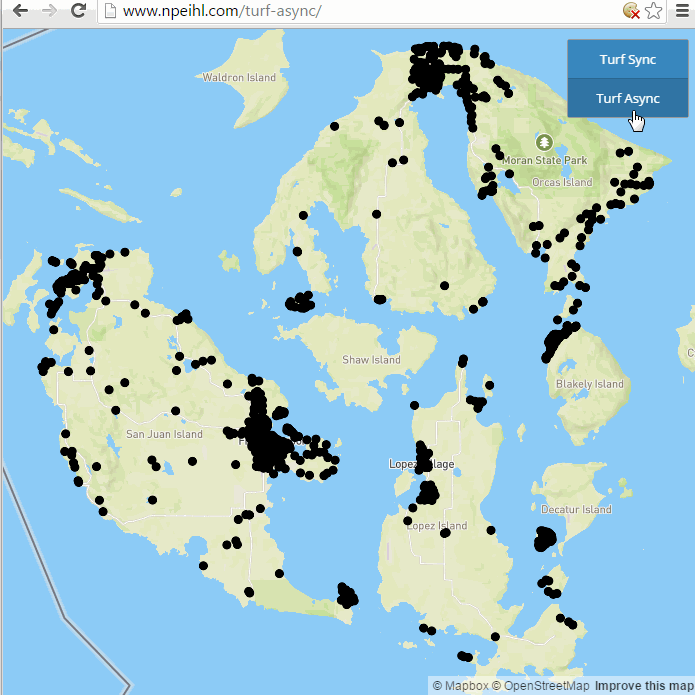

# Turf Async

A simple Mapbox-GL.js app demonstrating how to use Turf.js with web workers to run geoprocesses asynchronously

## Why?
Turf.js is great for doing small geoprocessing jobs in the browser. However, with larger jobs, it can freeze the browser for long periods. While the browser is waiting for the Turf process to complete, you can't pan or zoom on the map or even switch browser tabs.

With web workers we can move the geoprocessing job off the main UI thread. This means we can still manipulate the map and switch browser tabs while we wait for the job to complete.

Notice how we can pan and zoom on the map while the Turf process is running in the background.

